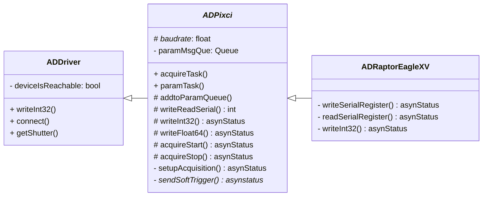

# ADPixci
[AreaDetector](https://areadetector.github.io/areaDetector/) driver for integrating [PIXCI&reg;](https://www.epixinc.com/products/framegrabbers.htm) camera link frame grabbers with supported cameras into [EPICS](https://epics-controls.org/). \
Uses the [XCLIB&trade; Library](https://www.epixinc.com/products/xclib.htm) to interface with frame grabbers.

### Supported Hardware
#### Cameras
- [Raptor Photonics Eagle XV](https://www.raptorphotonics.com/products/eagle-xv/) 4240
- [Raptor Photonics Eagle XV](https://www.raptorphotonics.com/products/eagle-xv/) 4710

#### Frame Grabbers
- PIXCI&reg; EB1 
- PIXCI&reg; E8

This software has only been tested on the above camera link frame grabbers but *should* work for other similar ones too.

#### Manuals

[The PIXCI® E8 User's Manual](https://www.epixinc.com/manuals/pixci_e14el/index.htm) and [PIXCI® EB1 User's Manual](https://www.epixinc.com/manuals/pixci_eb1/index.htm) from [EPIX, Inc](https://www.epixinc.com) were used to inform the development of ADPixci. \
The Eagle XV II Instruction Manual from [Raptor Photonics](https://www.raptorphotonics.com/) was used to inform the development of ADRaptorEagleXV, but it is only available upon request from their support team.

### Architecture
The high level architecture of this driver is shown in the below diagram. \
*Note: this does not show all methods and attributes.*

The abstract class ADPixci inherits from the base areaDetector driver and provides generic code for using PIXCI&reg; frame grabbers with areaDetector. \
ADRaptorEagleXV inherits from ADPixci, providing camera specific code and serial commands.

*Note: Other cameras that can be used with the PIXCI&reg; frame grabbers can inherit from ADPixci in a similar fashion, adding in their respective serial commands and quirks.*